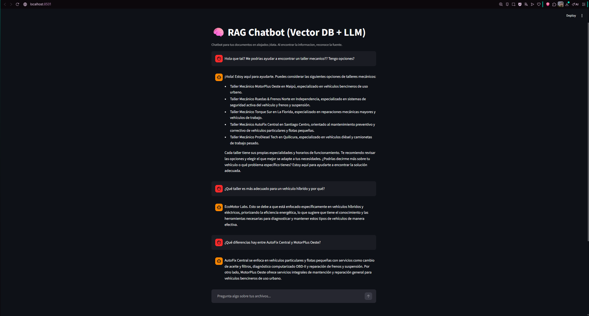

# RAG Chatbot con LLM y Vector Database
Chatbot basado en Retrieval-Augmented Generation (RAG) que responde preguntas utilizando documentos propios mediante un modelo de lenguaje y una base de datos vectorial.

El proyecto demuestra el uso práctico de LLMs, embeddings y búsqueda semántica en una arquitectura RAG ejecutada localmente.

## Demostracion RAG Chatbot

## Tecnologías
- Python
- Streamlit
- LlamaIndex
- ChromaDB
- Ollama
- HuggingFace Embeddings

## Ingestar documentos
1. Copiar archivos TXT, PDF o MD en la carpeta `data/`
2. Ejecutar: 
* python ingest.py

## Ingestar documentos
* streamlit run app.py

## Abrir en el navegador:
http://localhost
